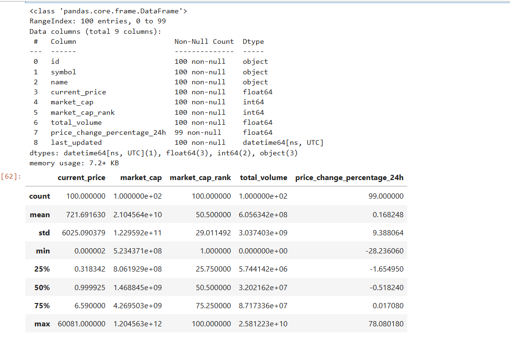
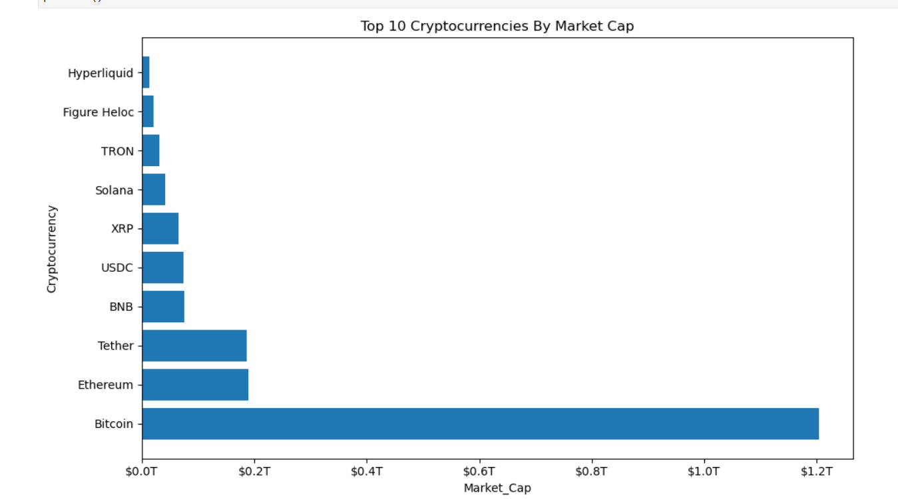
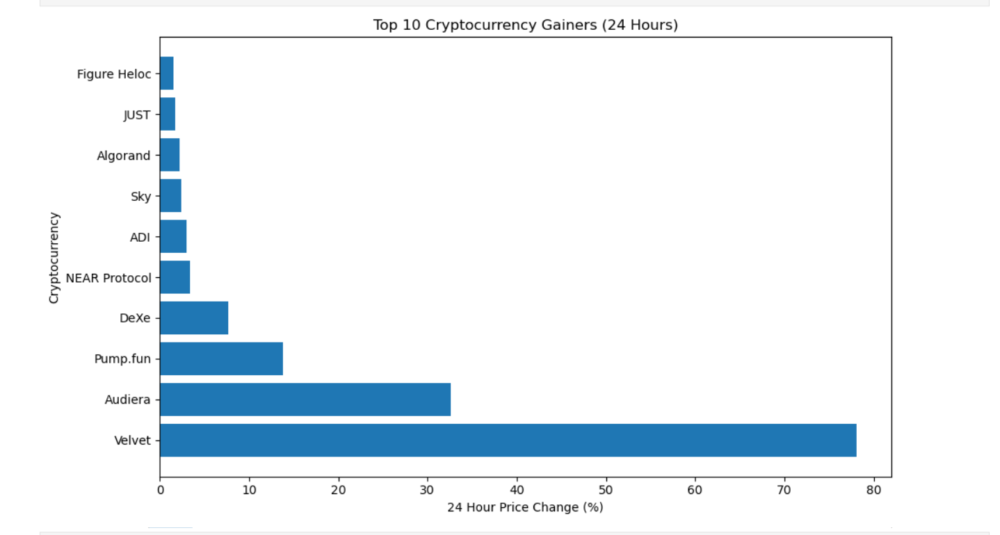

# Cryptocurrency Market Intelligence Pipeline

Working with APIs is often introduced as a simple exercise: send a request, receive a JSON response, convert it into a DataFrame, and export it to CSV. While that demonstrates how to consume an API, it doesn't say much about how analysts actually work with data.

This project started from that same point but gradually shifted toward a different objective. Instead of treating the API response as the final result, I approached it as the beginning of an analytical workflow.

The first challenge wasn't visualization—it was deciding what the dataset should look like. The CoinGecko API returns considerably more information than was needed for the analysis, so the raw response was preserved separately while a second DataFrame was created containing only the fields relevant to the business questions being explored. Separating the raw data from the analytical dataset made later transformations easier without losing the original source.

Once the data was structured, the next step was exploratory data analysis rather than immediately creating charts. Before asking business questions, it was important to understand the dataset itself—its structure, completeness, distributions, and potential outliers. Looking at summary statistics first made it easier to understand what the visualizations were actually showing.

Rather than creating charts simply because the data existed, each visualization was built to answer a specific question.

The analysis focuses on two questions:

* Which cryptocurrencies currently dominate the market by market capitalization?
* Which cryptocurrencies recorded the highest percentage gains during the previous 24 hours?

Preparing a separate dataset for each visualization kept every chart focused on a single objective instead of repeatedly working from one large DataFrame. That approach also made the notebook easier to read and mirrors the way analytical workflows are typically organized.

One small but interesting detail involved presenting market capitalization. The underlying data remains stored as its original numerical values, while the visualization formats the axis labels into trillions for readability. The presentation changes, but the underlying data does not—a small distinction that becomes important when building analytical reports.

Although the project analyzes only a single market snapshot, it demonstrates the complete workflow of collecting external data, preparing it for analysis, exploring the dataset, answering business questions, and communicating findings through visualizations and written observations.

## Project Workflow

```text
CoinGecko API
        │
        ▼
JSON Response
        │
        ▼
Raw DataFrame
        │
        ▼
Feature Selection
        │
        ▼
Data Cleaning & Transformation
        │
        ▼
Exploratory Data Analysis
        │
        ▼
Business Question 1
        │
        ▼
Visualization & Insights
        │
        ▼
Business Question 2
        │
        ▼
Visualization & Insights
```

## Technologies Used

* Python
* Requests
* Pandas
* Matplotlib
* Jupyter Notebook

## Repository Structure

```text
crypto_market_intelligence.ipynb
crypto_market.csv
README.md
```

## Business Questions

**1. Which cryptocurrencies dominate the market by market capitalization?**

A horizontal bar chart compares the largest cryptocurrencies by market capitalization to understand how concentrated the market currently is.

**2. Which cryptocurrencies recorded the strongest performance over the previous 24 hours?**

A second visualization identifies the highest-performing cryptocurrencies based on daily percentage price change.

## Key Observations

* Bitcoin continues to dominate the market by a considerable margin.
* Market capitalization is concentrated among a relatively small number of cryptocurrencies.
* Daily returns vary substantially across assets, highlighting the short-term volatility of the cryptocurrency market.
* A structured API response can be transformed into an analysis-ready dataset with relatively little preprocessing when an appropriate workflow is established.

## Future Improvements

Rather than treating this as a finished project, this workflow could be extended by collecting daily market snapshots to build a historical dataset. That would make it possible to analyze long-term trends, calculate rolling statistics, compare assets over time, integrate SQL for persistent storage, and build interactive dashboards in Power BI.

## One thing I took away from building this project

When I started this project, my goal was simply to work with a REST API. I assumed the interesting part would be sending the request and collecting the data.

It turned out that retrieving the data was the easiest step.

Most of the work happened after the API call—deciding which fields actually mattered, separating raw data from analytical data, understanding the dataset through exploratory analysis before creating visualizations, and making sure every chart answered a specific business question instead of simply displaying numbers.

That shift in perspective changed the way I think about analytics projects. Collecting data is only the starting point. The real value comes from preparing it, understanding it, and presenting it in a way that helps answer meaningful questions.

## Screenshots

### Exploratory Data Analysis



---

### Market Capitalization Analysis



---

### Top Cryptocurrency Gainers


